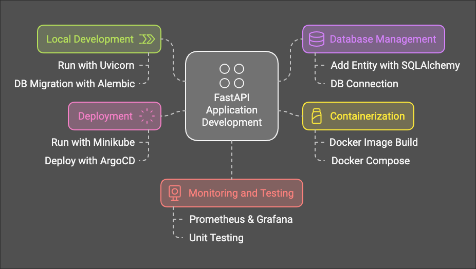
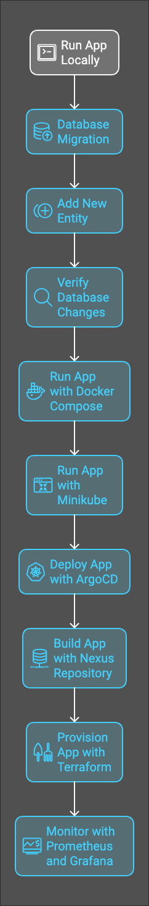

# Guide
1. run app with uvicron on local 
2. make db migration with alembic + pydenic
3. add new entity with sql alachmy
4. connect with psql to see new table
5. run app with docker compose
6. run app with minikube
7. deploy app with ArgoCd and use GitOps 
8. build app with Nexus Repository
9. provision app with Terraform
10. build app with cross-plan
11. see app in kube-apps / lens / rancher
12. build and see dashboard prometheus and grafana


## build and push Docker Image
```bash
docker build -t simon658/fastapi-app:latest .
docker push simon658/fastapi-app:latest
```

## Kubernetes - how to update the Deployment in the values.yaml
```bash
image:
  repository: simon658/fastapi-app
  tag: latest
  pullPolicy: Always
```

## update the Helm Chart
```bash
helm upgrade --install fastapi-app ./helm --namespace default
kubectl rollout restart deployment fastapi-app-new-employee-app -n default
```

## DB migration
```bash
alembic revision --autogenerate -m "Add product_version table"
alembic upgrade head
```

## CLI App
```bash
python main.py
```

## DB connection
```bash
psql -U simonravitz -h localhost postgres
```

## DB session info
```bash
handling the database session using the Depends(get_db) pattern, which is typical for managing database sessions in FastAPI. The Depends(get_db) injects a database session (Session) into the route function and ensures that the session is available for the duration of the request.
```

## FastAPI
```bash
uvicorn src.main:app --reload
```

## Custom Decorator
```bash
@log_datetime
------------------------------
Run on: 2024-09-11 18:57:10
------------------------------
INFO:     127.0.0.1:61362 - "GET /api/employees HTTP/1.1" 200 OK
```

##  DTO using Pydantic BaseModel
```bash
class HealthCheckDTO(BaseModel):
    status: str
    version: str = None
    buildTime: str = None
```

## SDK usage
```bash
health_response = client.get_health(environment=environment)
```

## docker-compose
```bash
docker-compose up --build
```

## Kubernetes
```bash
minikube start
```

## Kubernetes
```bash
kubectl config get-contexts
```

## Kubernetes
```bash
kubectl config use-context minikube
```

## run the app in Kubernetes
```bash
kubectl port-forward svc/fastapi-app-new-employee-app 8081:80 -n default
```

## GitOps using ArgoCD
```bash
kubectl port-forward svc/argocd-server -n argocd 8083:443
```

## Get Password for ArgoCD UI 
```bash
 argocd admin initial-password -n argocd
```

## Paging & API Schema Response
```bash
{
  "success": true,
  "error": null,
  "result": {
    "environment": "dev",
    "version": "0.1.0",
    "build_time": "17/09/2024 17:46:00"
  },
  "paging": null
}
```

## Nexus - Artifact Register Repository
```bash
/usr/local/nexus/bin/nexus start
docker exec -it nexus cat /nexus-data/admin.password
```

## Verify the Deployment
```bash
kubectl get deployments
kubectl get pods
kubectl describe deployment employee-management-system
```

## Check Helm Deploy
```bash
 helm status employee-management-system
```

## Logs
```bash
 helm install employee-management-system ./helm --debug --dry-run
```

## API Docs
```bash
Swagger - http://127.0.0.1:8081/docs#
```

## EKS Cluster - Prometheus & Grafana, Monitoring Service
```bash
kubectl --namespace=prometheus port-forward deploy/prometheus-server 9090:9090
kubectl --namespace grafana port-forward grafana-748f57f84b-55s7p 3000:3000
```

## Pagination
```bash
Supporting two poplur approchaes: cursor based and offsed limit based 
```

## CI workflow
```bash
GitHub Actions
```

## KubeApps
```bash
kubectl port-forward -n kubeapps svc/kubeapps 8080:80
kubectl port-forward svc/worthless-belief-wordpress 8083:80 --namespace default
```

## Service Architecture
```bash
the code is normally divided into four layers:
Controller - Represents standard Spring controllers, no business logic should be present here barring extreme circumstances.
Service - Represents both the business logic layer and the facade for web requests. As we use the ResultRO object to wrap most usual requests, it is normally also tasked with packaging the payload inside a ResultRO.
Handler - Mostly used for code that is not strictly business logic, but may be used for business logic if the action in question needs to be transactional.
DAO/DAL (Data Access Object/Layer) - Strictly used for interaction with the database through various means. No logic should be present in this layer.
```

## Tests
```bash
Unit - test_business_logic_layer_using_mock_without_using_db_and_service.py
In the project there's no really Business Process Layer, The current controller talk to DB methods directly via the service layer'
Integration - test_employee_service_no_mock_and_build_db.py
Component - test_employee_controller_without_mock_with_used_service_and_with_db_also_using_sdk.py
```

## Code freeze
```bash
The end of a version is marked with a code freeze. 
When a code freeze occurs, a new master branch is created from develop on each service for the new version. From that point on, the master branch is effectively locked, and any code added to develop afterwards will be targeted for the version after that.
```

## Database Changes
```bash
Database changes are handled exclusively via Flyway/Alembic migrations except for a few extreme cases.
Logical separation is maintained between dev migrations and production migrations for quality control and possible optimizations.
Each new migration will enter the “dev” folder of its relevant version. 
Prior to code freeze, the developer in charge of Alembic/Flyway will manually examine each migration set to run and copy them to the “prod” directory of the same version. 
Sometimes, the queries are optimized to reduce downtime in production.
```

## Code Review & Pull Requests
```bash
New code enters the code base via pull requests - the developer pushes his/her branch to origin and open a pull request on Bitbucket/Github.
All pull requests, when merged, are squashed into one commit. As such, the pull request title must represent the final commit name.
```

## Hotfix Procedure
```bash
A hotfix is defined as any change that is targeted to a version whose master branch has already been created
```

## Create Secrets in Kubernetes
```bash
 kubectl create secret generic postgres-secret \
  --namespace=new-employee-app \
  --from-literal=username=simonravitz \
  --from-literal=password=Aa123456!
```

## Endpoints API
```bash
# Get Health Check Product Version  
```

## Postgres Tables
```bash
  
```
